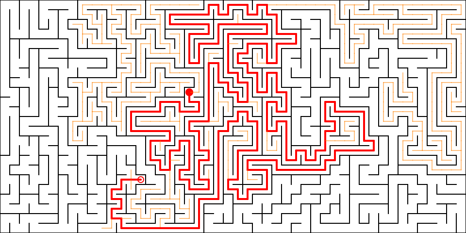

# wasm-maze

## About

An implementation of some [simply connected](https://en.wikipedia.org/wiki/Simply_connected_space) [maze generating](https://en.wikipedia.org/wiki/Maze_generation_algorithm) and [maze solving](https://en.wikipedia.org/wiki/Maze-solving_algorithm) algorithms in Rust WebAssembly.



## Prerequisites

Install [wasm-pack](https://github.com/rustwasm/wasm-pack).

## Compile

```bash
wasm-pack build --target web
```
or optimised for release
```bash
wasm-pack build --target web --release
```

## Serve and run

```bash
# Python 2.x
python -m SimpleHTTPServer
# Python 3.x
python3 -m http.server
```

Run in a browser at [http://localhost:8000](http://localhost:8000).
